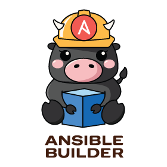
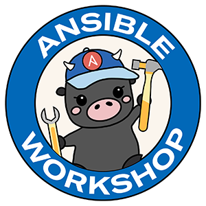

# Ansible Logos
This is a repostiory of official community upstream logos for different Ansible projects.

[Check out this blog post](https://opensource.com/article/21/4/ansible-community-logos)

# These logos are trademarked

Check out our [TRADEMARKS.md](TRADEMARKS.md)

Also logos have [CC BY-SA 4.0](https://creativecommons.org/licenses/by-sa/4.0/)

# Ansible Builder

CLI name: `ansible-builder`
Project: [https://github.com/ansible/ansible-builder/](https://github.com/ansible/ansible-builder/)

Platform feature name: **execution environment builder**

A new command line tool that creates new or layers on existing execution environment containers. This tool ensures all components needed for Ansible execution, such as Ansible Core, Python packages and all collections are added to the container.

# Ansible Demo

Logo for official Ansible Automation demos.

Examples of project repos using Ansible Demo Logo
- [https://github.com/ansible/product-demos/](https://github.com/ansible/product-demos/)
- [https://github.com/ansible/instruqt/](https://github.com/ansible/instruqt/)

# Ansible Runner

Ansible Runner is a tool and python library that helps when interfacing with Ansible directly or as part of another system whether that be through a container image interface, as a standalone tool, or as a Python module that can be imported. The goal is to provide a stable and consistent interface abstraction to Ansible.

Project: [https://github.com/ansible/ansible-runner](https://github.com/ansible/ansible-runner)

# Ansible Workshop

Logo for official Ansible Automation Workshops

Project: [https://ansible.com/workshops](https://ansible.com/workshops)

# Receptor

Receptor is an overlay network intended to ease the distribution of work across a large and dispersed collection of workers. Receptor nodes establish peer-to-peer connections with each other via existing networks. Once connected, the Receptor mesh provides datagram (UDP-like) and stream (TCP-like) capabilities to applications, as well as robust unit-of-work handling with resiliency against transient network failures.

Project: [https://github.com/ansible/receptor](https://github.com/ansible/receptor)

# Visual Studio Code Ansible Extension

Project: [https://github.com/ansible-community/vscode-ansible](https://github.com/ansible-community/vscode-ansible)

