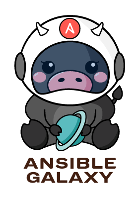

# Ansible Logos

This is a repostiory of official community upstream logos for different Ansible projects.

[Check out this blog post](https://opensource.com/article/21/4/ansible-community-logos)

## These logos are trademarked

## Logo trademarks

Check out our [TRADEMARKS.md](TRADEMARKS.md)

Also logos have [CC BY-SA 4.0](https://creativecommons.org/licenses/by-sa/4.0/)

## Usage guidelines

Ansible brand assets are for the approved use of Ansible partners, vendors, press and community members.
Use the Ansible logos and marks for presentations about your use of Ansible and Ansible products to user groups and in other community settings.
However, please use assets as indicated below.
Any use of the Ansible logos and marks without Ansible approval is prohibited.

## Correct logo use

The Ansible "A" should always appear inside the circle, never outside of the circle.

For example, the following is correct use of the white logo:

In the following example, the mango logo is used correctly:

### Incorrect logo use

In contrast to the preceding example, the following is misuse of the white logo:

The following shows misuse of the mango logo:

## Ansible Builder

CLI name: `ansible-builder`
Project: [https://github.com/ansible/ansible-builder/](https://github.com/ansible/ansible-builder/)

Platform feature name: **execution environment builder**

A new command line tool that creates new or layers on existing execution environment containers. This tool ensures all components needed for Ansible execution, such as Ansible Core, Python packages and all collections are added to the container.

## Ansible Demo

Logo for official Ansible Automation demos.

Examples of project repos using Ansible Demo Logo

- [https://github.com/ansible/product-demos/](https://github.com/ansible/product-demos/)
- [https://github.com/ansible/instruqt/](https://github.com/ansible/instruqt/)

## Ansible Runner

Ansible Runner is a tool and python library that helps when interfacing with Ansible directly or as part of another system whether that be through a container image interface, as a standalone tool, or as a Python module that can be imported. The goal is to provide a stable and consistent interface abstraction to Ansible.

Project: [https://github.com/ansible/ansible-runner](https://github.com/ansible/ansible-runner)

## Ansible Workshop

Logo for official Ansible Automation Workshops

Project: [https://ansible.com/workshops](https://ansible.com/workshops)

## Receptor

Receptor is an overlay network intended to ease the distribution of work across a large and dispersed collection of workers. Receptor nodes establish peer-to-peer connections with each other via existing networks. Once connected, the Receptor mesh provides datagram (UDP-like) and stream (TCP-like) capabilities to applications, as well as robust unit-of-work handling with resiliency against transient network failures.

Project: [https://github.com/ansible/receptor](https://github.com/ansible/receptor)

## Visual Studio Code Ansible Extension

Project: [https://github.com/ansible-community/vscode-ansible](https://github.com/ansible-community/vscode-ansible)

## Product Logos and Icons

| Logo | Icon
| --- | ---
|  |    
|  |    
|  |    

- Logo is used in the application masthead.
  - Logo = 64px high
  - Logos are always on a black background in the applications.
- Icons are used in the browser tab and the desktop.
  - Desktop icons = 48x48px
  - Browser tab icons = 16x16px
  - Icons need to support good on both light and dark themes.
